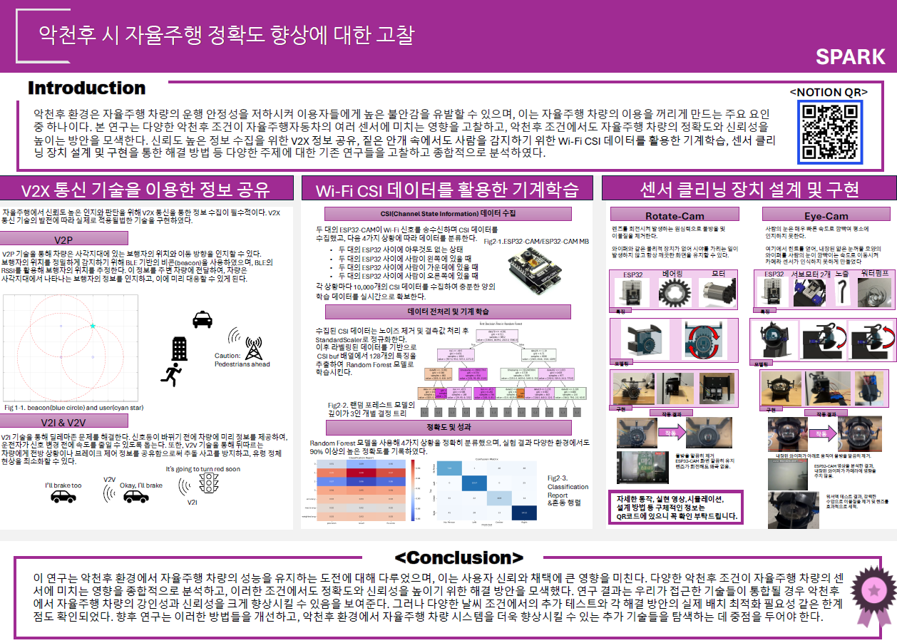

# 🚗 METLAB 연구 프로젝트 (ESP32-CAM + CSI)

본 프로젝트는 **ESP32-CAM 기반 CSI(Channel State Information) 데이터**를 활용하여  
악천후 환경에서 **환경 변화를 인식하고 분류하는 기계학습 모델**을 설계하는 것을 목표로 한다.

[notion link](https://plant-ski-b85.notion.site/METLAB-6e614358bdc34c58be3cacf1985ab2c9)

<br>




---

## 📌 연구 흐름

### 1. 문제 정의
- 자율주행 시스템은 **비, 눈, 안개 등 악천후 상황**에서 주변 환경 인식의 정확도가 저하될 수 있다.
- 본 연구는 이러한 한계를 보완하기 위해 **무선 채널 정보(CSI)** 를 활용하여  
  환경 변화를 인식할 수 있는 가능성을 확인하고자 하였다.

---

### 2. 데이터 수집
- **ESP32-CAM 보드** 활용  
- 공식 Espressif 저장소에서 **esp-csi 라이브러리**를 클론하여 사용  
  - 예제: `examples/get-started/csi_recv_router`
  - 이 예제를 기반으로 **CSI 데이터 수신 및 CSV 저장** 수행
- 데이터 수집 절차:
  1. ESP-IDF 환경 설정 및 라이브러리 빌드
  2. `csi_recv_router` 예제 펌웨어 빌드 및 플래시
  3. PowerShell을 통해 CSV 파일로 CSI 데이터 저장
- 수집 데이터 예시:
  - `0923_csi_left.csv`
  - `0923_csi_mid.csv`
  - `0923_csi_right.csv`

---

### 3. 데이터 전처리
- **CSI 데이터**
  - Amplitude, Phase 추출
  - 잡음 제거
  - 결측치 처리
  - Normalization (정규화, Scaler 적용)
- **라벨링**
  - Left / Mid / Right → `1, 2, 3` 라벨 부여
  - 결측값 제거 후 학습용 데이터셋 생성

---

### 4. 학습 데이터 구성
- 전처리된 CSI 데이터를 하나의 학습 데이터셋으로 병합
- 방향 정보(Left / Mid / Right)를 기준으로 분류 데이터 구성
- Scaler 적용 후 모델 입력 형태로 변환

---

### 5. 학습 및 모델 설계
- **ML 기법**: 랜덤 포레스트(Random Forest) 적용
- 전처리된 CSI 데이터를 기반으로 분류 모델 학습 수행
- 다양한 실험 환경에서 성능을 비교하고 정확도를 평가

---

### 6. 평가 (실험 결과)
- 수집한 CSI 데이터를 기반으로 환경 및 위치 변화에 대한 분류 성능을 평가
- 실험 결과, 다양한 환경에서도 **90% 이상의 높은 정확도**를 확인하였다.
- 결론적으로, CSI 데이터는 환경 변화를 인식하는 데 유의미한 정보로 활용될 수 있음을 확인하였다.

---

## 📊 연구 절차 흐름도

    A[ESP32-CAM CSI 데이터 수집] --> B[데이터 전처리]
    B --> C[학습 데이터 구성]
    C --> D[Random Forest 학습]
    D --> E[정확도 평가]

---


## ⚙️ 실행 과정 (ESP32-CAM 환경)

### 1. ESP-IDF 환경 설정
- ESP-IDF 설치 확인
- 환경 변수 등록 (`export.bat` 실행)

## ESP-IDF 설치
ESP-IDF는 용량이 크기 때문에 레포에 포함하지 않았습니다.  
아래 명령어로 설치하세요:
```bash
git clone -b v5.3 https://github.com/espressif/esp-idf.git esp-idf-v5.3
```

### 2. ESP-CSI 라이브러리 설치
```bash
git clone https://github.com/espressif/esp-csi.git
cd esp-csi/examples/get-started/csi_recv_router
```
### 3. 빌드 및 플래싱
```bash
idf.py set-target esp32
idf.py build
idf.py -p COM5 flash
```
### 4. 모니터링 및 데이터 저장
```bash
powershell -Command "& { idf.py -p COM5 monitor | Tee-Object -FilePath 0923_csi.csv }"
```

- COM 포트 확인 필수
- 결과 CSV 파일 자동 저장됨


## 🗂️ 데이터 처리 및 학습 파이프라인
1. CSV 데이터 수집 (`left`, `mid`, `right`)
2. 결측값 제거 및 Normalization
3. 세 구간 데이터 병합
4. 라벨링 (1=Left, 2=Mid, 3=Right)
5. Scaler 적용 후 학습 데이터 구축
6. 랜덤 포레스트(Random Forest) 학습
7. 새로운 워크 데이터 테스트 및 평가

---

## 📝 결론 및 의의
- CSI 데이터는 영상 기반 자율주행의 한계를 보완할 수 있는 유용한 보조 신호임.
- 악천후 환경에서의 인식 성능을 높여 **자율주행 시스템의 신뢰성과 안정성 향상**에 기여.


